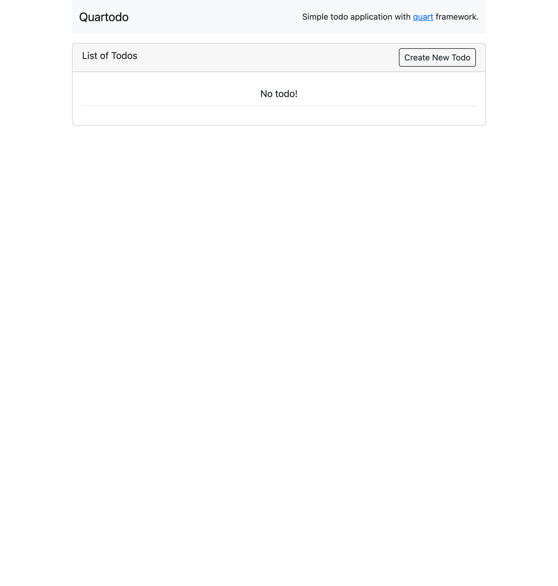
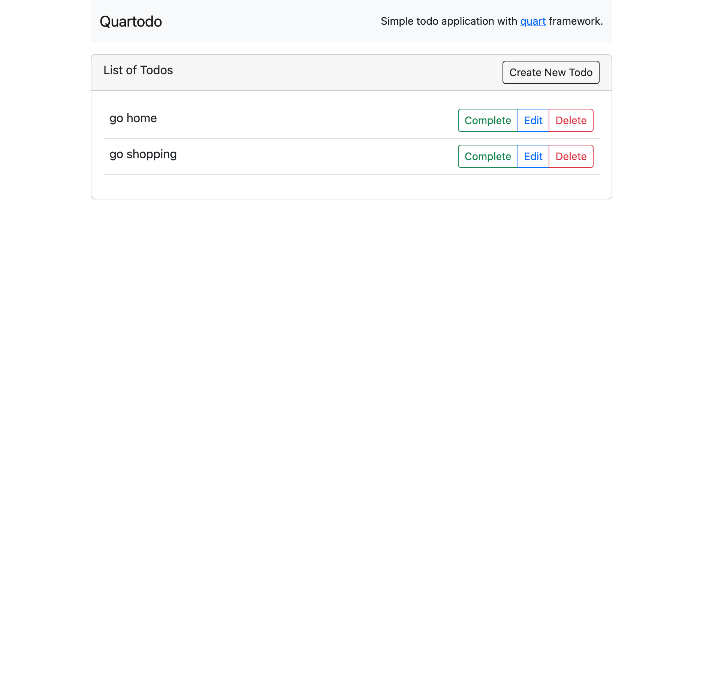
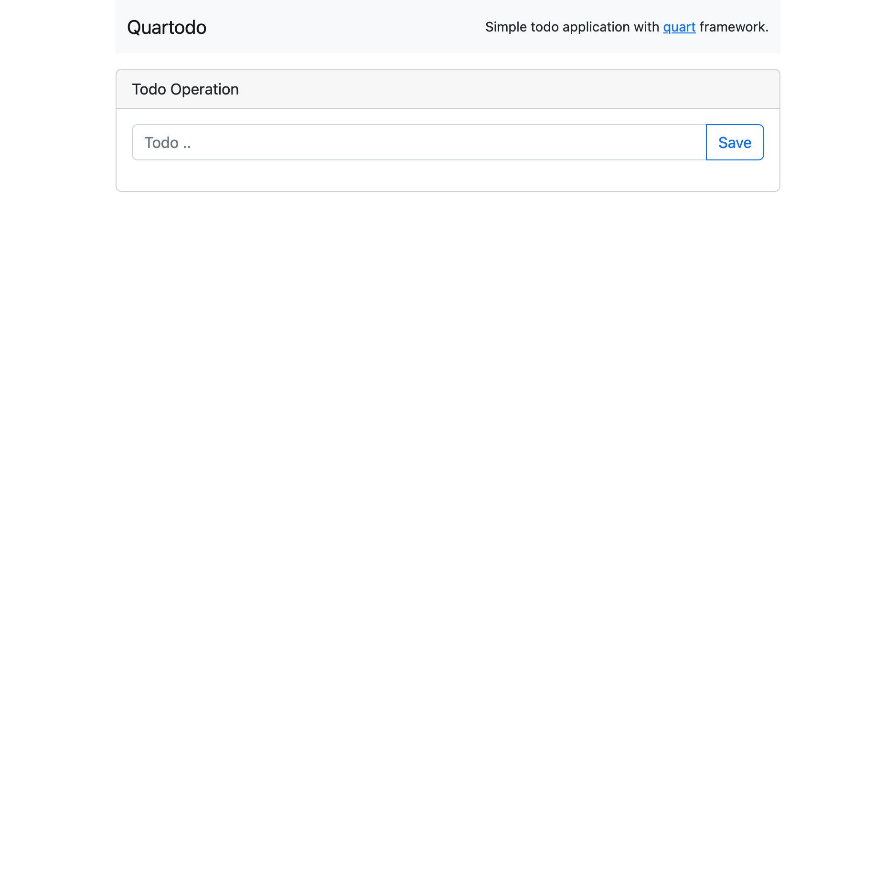
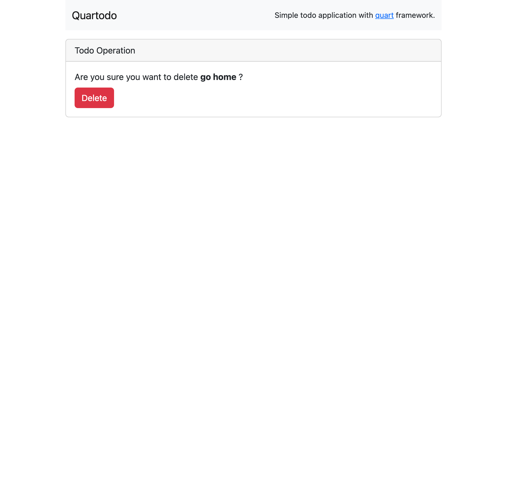
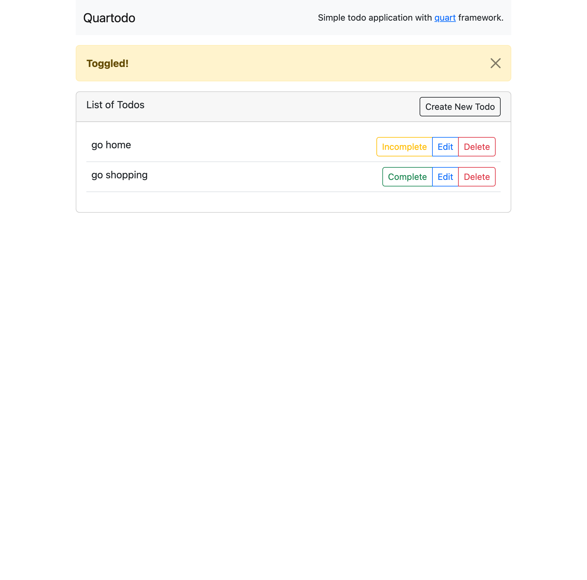

# Quartodo

Simple todo application with [quart](https://github.com/pallets/quart) web framework.

## Installation

```shell
poetry install
```

## Running

```shell
poetry run python app.py
```

## Screenshots

| #1                 | #2                    |
|--------------------|-----------------------|
| Home with no todos |    |
| Home with todos    |  |
| Create/Edit todos  |    |
| Delete todo        |    |
| Toggle todo        |    |

